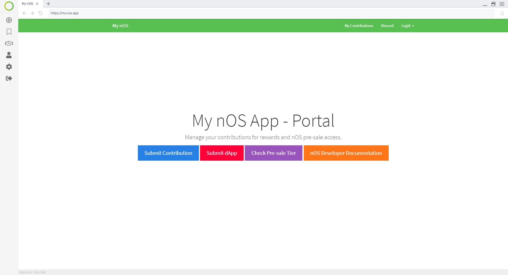

<p align="center">
  
</p>

<h1 align="center">nOS</h1>
<p align="center">
  <a href="https://github.com/nos/client/releases">
    
  </a>
  <a href="http://makeapullrequest.com">
    
  </a>
  <a href="https://discordapp.com/invite/eGFAskm">
    
  </a>
  <a href="https://circleci.com/gh/nos/client/tree/develop">
    
  </a>
  <a href="https://renovatebot.com/">
    
  </a>
  <a href="https://github.com/prettier/prettier">
    
  </a>
  <a href="https://codecov.io/gh/nos/client">
    
  </a>
</p>
<p align="center">
  <strong>nOS</strong> is a blockchain powered virtual operating system that serves as the gateway to Decentralized Applications.
</p>
<p align="center">
  The <strong>nOS Client</strong> (Developer MVP Release) allows for the development of Decentralized Applications that interact with Smart Contracts in the back-end.
</p>

---

# Getting Started with nOS

The standalone client installers can be found [here](https://github.com/nos/client/releases). To build manually, the client can be cloned from GitHub and run using the development steps below.

### Commands

```bash
# Cloning from Github
git clone https://github.com/nos/client.git

# Install dependencies and launch the nOS client
# This is used to start developing on the nOS client
yarn install && yarn start

# Testing command
yarn test

# Testing with debug (repl) command
yarn test:debug

# Distribution command (code signing certificates are required to make this work)
yarn dist
```

# Contribute to this repository

We welcome contributions to the code base. If you are interested in becoming a contributor, please read the [contributing guide](/.github/CONTRIBUTING.md) that covers the following:

- [Reporting bugs](/.github/CONTRIBUTING.md#reporting-bugs)
- [Suggesting enhancements](/.github/CONTRIBUTING.md#Suggesting-Enhancements)
- [Code contribution guidelines](/.github/CONTRIBUTING.md#Code-Contribution)

There is a [specific channel called develop](https://discord.gg/CXZb3BS) on Discord to discuss development.

# Contribute by building a dApp on nOS

Need some help with building nOS dApps? Check out our dedicated [documentation website](https://docs.nos.io/) containing useful info for the following topics:

- [**nOS Client API Documentation**](https://docs.nos.io/docs/nos-client/api.html)
- [Create nOS dApp Usage](https://docs.nos.io/docs/create-nos-dapp/installation-usage.html)
- [nOS Local Setup and usage](https://docs.nos.io/docs/nos-local/installation-usage.html)

**Check out the documentation of the [Create nOS dApp CLI tool](https://docs.nos.io/docs/create-nos-dapp/installation-usage.html) to get going quickly.**

Resources:

- [Create nOS dApp repository](https://github.com/nos/create-nos-dapp)
- [Create nOS dApp example (NeoBlog implementation)](https://github.com/nos/dapp-neoblog)

# Releasing

## Automated Deployment

We use [CircleCI](https://circleci.com/gh/nos/client) to automatically create builds based upon git tags.

1. run `yarn release --dry-run` - Note if the output version tag/changelog is correctly generated.
2. run `yarn release` - This will generate the changelog, update the version in package.json and create and push a tag.
3. The deploys jobs will be triggered and upload the artifacts to Github Release page as a draft.

## Manual Deployment: macOS

1. Export the following variables:
   1. `CSC_LINK` - This is the path to the .p12 certificate file
   2. `CSC_KEY_PASSWORD` - This is the password of the .p12 certificate file
   3. `CSC_IDENTITY_AUTO_DISCOVERY` - Set to `false` to disable usage of local keychain (By default it looks in your `login` keychain)
   4. `GH_TOKEN` - This is used to upload the artifacts to Github
2. Create the distributable, i.e. `yarn dist`.
3. Locate and upload the following files as these are required for the auto-updater to work:
   1. `dist/nOS-1.0.0-mac.zip`
   2. `dist/nOS-1.0.0-mac.dmg`
   3. `dist/nOS-1.0.0-mac.dmg.blockmap`
   4. `dist/latest-mac.yml`

## Manual Deployment: Linux

1. Create the distributable, i.e. `yarn dist`.
2. Locate and upload the following files as these are required for the auto-updater to work:
   1. `dist/nOS-1.0.0-linux-amd64.snap`
   2. `dist/nOS-1.0.0-linux-x86_64.AppImage`
   3. `dist/latest-linux.yml`

## Manual Deployment: Windows

1. Export the following variables:
   1. `WIN_CSC_LINK` - This is the certificate file in text format
   2. `WIN_CSC_KEY_PASSWORD` - This is the password of the certificate file
   3. `GH_TOKEN` - This is used to upload the artifacts to Github
2. Create the distributable, i.e. `yarn dist`.
3. Locate and upload the following files as these are required for the auto-updater to work:
   1. `dist/nOS-1.0.0-win.exe`
   2. `dist/nOS-1.0.0-win.exe.blockmap`
   3. `dist/latest.yml`

### Generating hashes for the artifacts

- MacOS/Linux: `shasum -a 256 ./*` - Where the final argument is the location of the artifacts
