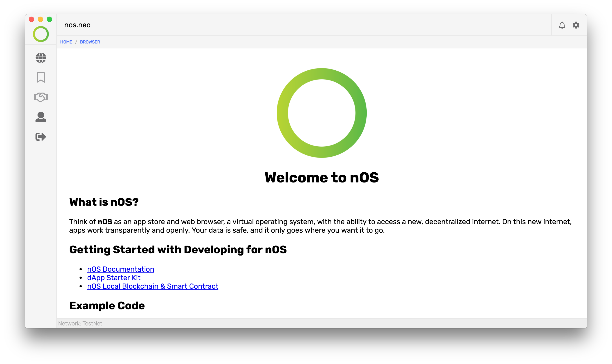

<p align="center">
  
</p>

<h1 align="center">nOS</h1>
<p align="center">
  <strong>nOS</strong> is a NEO-Powered virtual operating system that allows for the development and discovery of, and interaction with Decentralized Applications.
</p>

## Getting Started

The app can be cloned from GitHub and run using the
[development steps](#development) below.

## nOS Developer Documentation

Detailed documentation for developing against nOS can be found
[here](https://github.com/nos/client/blob/master/docs/index.md).

## Development

```
yarn install && yarn start
```

## Testing

```
yarn test
```

## Distribution

```
yarn dist
```
