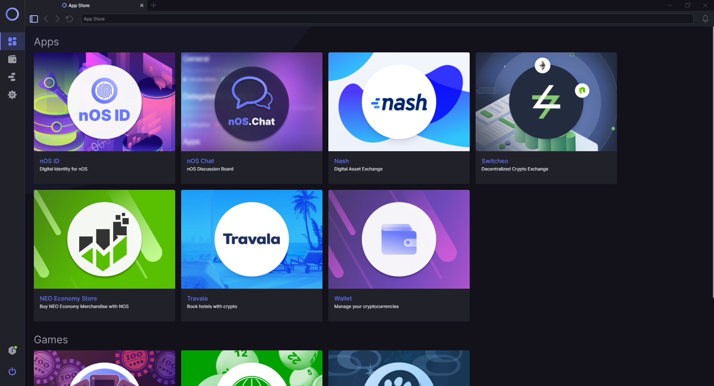

<p align="center">
  
</p>

<h1 align="center">nOS</h1>
<p align="center">
  <a href="https://github.com/nos/client/releases">
    
  </a>
  <a href="http://makeapullrequest.com">
    
  </a>
  <a href="https://discordapp.com/invite/eGFAskm">
    
  </a>
  <a href="https://circleci.com/gh/nos/client/tree/develop">
    
  </a>
  <a href="https://greenkeeper.io/">
    
  </a>
  <a href="https://github.com/prettier/prettier">
    
  </a>
  <a href="https://codecov.io/gh/nos/client">
    
  </a>
</p>
<p align="center">
  <strong>nOS</strong> is a NEO-powered virtual operating system that serves as the gateway to the Blockchain-powered Smart Economy.
</p>
<p align="center">
  The <strong>nOS Client</strong> (Developer MVP Release) allows for the development of Decentralized Applications that interact with Smart Contracts in the back-end.
</p>

---

# Getting Started with nOS

The standalone client installers can be found [here](https://github.com/nos/client/releases).
To build manually, the client can be cloned from GitHub and run using the development steps below.

### Commands
```
// Cloning from Github
git clone https://github.com/nos/client.git

// Install dependencies and launch the nOS client
// This is used to start developing on the nOS client
yarn install && yarn start

// Testing command
yarn test

// Distribution command
yarn dist
```

&nbsp;

## Getting started with nOS Development
Need some help with building nOS dApps? Check out our dedicated [documentation website](https://docs.nos.io/) containing useful info for the following topics:
- [**nOS Client API Documentation**](https://docs.nos.io/docs/nos-client/api.html)
- [Create nOS dApp Usage](https://docs.nos.io/docs/create-nos-dapp/installation-usage.html)
- [nOS Local Setup and usage](https://docs.nos.io/docs/nos-local/installation-usage.html)
- [Contribution Guidelines](https://docs.nos.io/docs/contributing.html)

Future resources:
- Tutorials
- List of known bugs
- List of coming features

&nbsp;

# Contribute to this repository
We welcome contributions to the code base. If you are interested in becoming a contributor, please read the [contributing guide](/.github/CONTRIBUTING.md) that covers the following:

- [Reporting bugs](/.github/CONTRIBUTING.md#reporting-bugs)
- [Suggesting enchancements](/.github/CONTRIBUTING.md#Suggesting-Enhancements)
- [Code contribution guidelines](/.github/CONTRIBUTING.md#Code-Contribution)


There is a [specific channel called develop](https://discord.gg/CXZb3BS) on Discord to discuss development.

&nbsp;

# Contribute by building a dApp on nOS
**Check out the documentation of the [Create nOS dApp CLI tool](https://docs.nos.io/docs/create-nos-dapp/installation-usage.html) to get going quickly.**

Resources:

- [Create nOS dApp repository](https://github.com/nos/create-nos-dapp)
- [Create nOS dApp example (NeoBlog implementation)](https://github.com/nos/dapp-neoblog)
- [nOS Client API Documentation](https://docs.nos.io/docs/nos-client/api.html)

&nbsp;

# Releasing
## Windows & Linux
We use [CircleCI](https://circleci.com/gh/nos/client) to automatically create builds based upon git tags.

1. Create a tag, e.g. `1.0.0`.
  a. `git tag -a 1.0.0`
  b. `git push origin 1.0.0`
2. Wait for `deploy_win64` and `deploy_linux` jobs to finish on CircleCI.
3. Open "Artifacts" tab & download executable files.

## macOS
1. Create the distributable, i.e. `yarn dist`.
2. Locate executable file `dist/nOS-1.0.0.dmg`.
